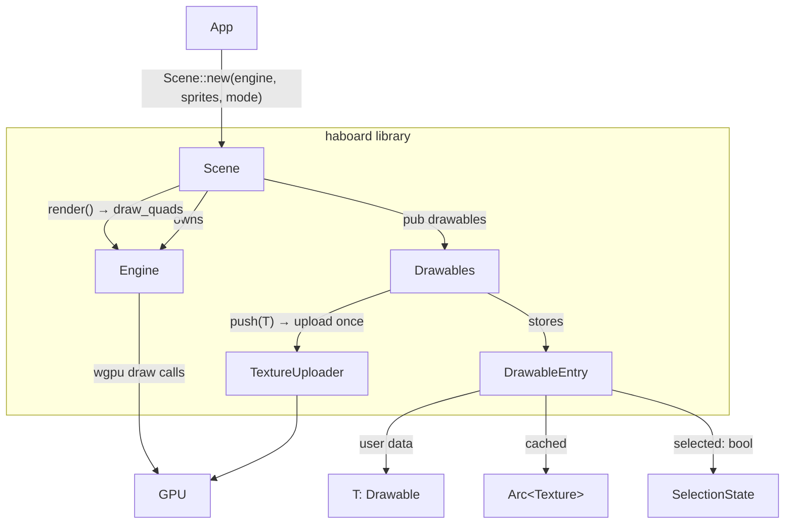

# HaBoard

A GPU-accelerated 2D sprite engine written in Rust, built on [wgpu](https://wgpu.rs) and [winit](https://github.com/rust-windowing/winit).

HaBoard provides a reusable library crate (`haboard`) for rendering and interacting with 2D sprites, plus a `demo-app` binary that shows the engine in action.

---

## Workspace layout

```
gpu-test/
├── haboard/        # Library crate — engine, scene, drawables, textures
└── demo-app/       # Binary crate — demo application
```

---

## Features

- **wgpu rendering** — pixel-space quad rendering with alpha blending; vertex shader converts pixel coordinates to NDC using a screen-size uniform.
- **`Drawable` trait** — implement one trait to make any struct renderable and interactable. The trait works with plain data types — no GPU handles required.
- **`ImageData`** — engine-independent image type (`Rgba` raw bytes or `Encoded` file bytes). Implement `Drawable::image()` returning `ImageData`; the engine uploads it to the GPU exactly once when the object is added.
- **`Drawables<T>`** — managed collection that owns GPU texture lifetimes and selection state. Provides `push()`, `iter()`, `iter_mut()`, `count()`, `max_z()`.
- **`Scene<T>`** — generic scene manager that owns the engine and a `Drawables<T>` and drives all interaction.
- **Two interaction modes**
  - `Edit` — click to select, drag a selected group, rubber-band selection with visual overlay (selection halo + tint).
  - `Run` — no selection UI; only unlocked drawables may be dragged (single topmost object at a time).
- **Explicit Z-order** — drawables expose `z()` / `set_z()`; render order and hit-testing are driven by Z values, not `Vec` position. Clicking an object brings it to the front by bumping its Z.
- **Alpha-aware hit testing** — `DrawableEntry` maps screen coordinates to texel coordinates and rejects transparent pixels, so clicks and rubber-band selection ignore see-through areas.
- **Drag-and-drop image import** — in Edit mode, image files dragged onto the window are decoded, scaled to fit, centred at the cursor, and added as new sprites.
- **Persistence** — scene state is serialized with [postcard](https://github.com/jamesmunns/postcard) on close and reloaded on next launch. `Sprite` (and `ImageData`) derive `serde::Serialize` / `Deserialize` directly — no translation layer needed.
- **Procedural textures** — the `textures` module generates checkerboards, solid colours, gradients, and anti-aliased circles entirely on the CPU.
- **Touch support** — primary-touch events are mapped to the same interaction handlers as mouse events.

---

## Prerequisites

- Rust toolchain (edition 2024, stable ≥ 1.85)
- A GPU with a Vulkan, Metal, DX12, or WebGPU-compatible driver

---

## Build & run

```sh
# build everything
cargo build

# run the demo in the default Edit mode
cargo run -p demo-app

# run in Run mode
cargo run -p demo-app -- --mode run
```

### CLI options

```
Usage: demo-app [OPTIONS]

Options:
      --mode <MODE>  Start the engine in edit or run mode [default: edit]
                     Possible values: edit, run
  -h, --help         Print help
  -V, --version      Print version
```

---

## Library API

Add the library to your `Cargo.toml`:

```toml
[dependencies]
haboard = { path = "../haboard" }
```

### Quick-start example

```rust
use haboard::{Engine, Scene, SceneMode, Sprite, textures};

// 1. Create the engine (owns the wgpu device/queue and the window).
let engine = Engine::new(window).await;

// 2. Build sprites — textures helpers return ImageData directly.
let sprites = vec![
    Sprite::new(0.0, 0.0, 256.0, 256.0, textures::gradient(128, 128)),
    Sprite::new(96.0, 96.0, 64.0, 64.0, textures::circle(64, [255, 100, 50])),
];

// 3. Hand everything to the scene.
//    Each sprite's ImageData is uploaded to the GPU here — exactly once.
let mut scene = Scene::new(engine, sprites, SceneMode::Edit);

// 4. In your event loop:
scene.handle_window_event(&event);  // forward winit events
scene.render();                     // draw the frame

// 5. Push new drawables at any time.
scene.drawables.push(Sprite::new(200.0, 200.0, 80.0, 80.0, my_image));
```

### Implementing a custom drawable

`Drawable` requires only plain data methods. No GPU handles are stored by the implementor.

```rust
use haboard::{Drawable, ImageData};

#[derive(serde::Serialize, serde::Deserialize)]
struct Card {
    x: f32,
    y: f32,
    z: f32,
    image: ImageData,
    pinned: bool,
}

impl Drawable for Card {
    fn x(&self) -> f32 { self.x }
    fn y(&self) -> f32 { self.y }
    fn width(&self) -> f32 { 120.0 }
    fn height(&self) -> f32 { 160.0 }
    fn z(&self) -> f32 { self.z }
    fn set_z(&mut self, z: f32) { self.z = z; }

    /// Called once when the card is added via `Drawables::push`.
    fn image(&self) -> ImageData { self.image.clone() }

    fn set_position(&mut self, x: f32, y: f32) { self.x = x; self.y = y; }
    fn locked(&self) -> bool { self.pinned }
}
```

Use `Scene<Box<dyn Drawable>>` to mix different types in the same scene:

```rust
let drawables: Vec<Box<dyn Drawable>> = vec![
    Box::new(card),
    Box::new(sprite),
];
let scene = Scene::new(engine, drawables, SceneMode::Edit);
```

### ImageData

`ImageData` is the bridge between user types and the GPU. It is cheap to clone (pixel bytes are `Arc`-backed) and fully serializable.

The `textures` helpers return `ImageData` directly, so you can pass them straight to `Sprite::new`:

```rust
use haboard::{Sprite, textures};

Sprite::new(0.0, 0.0, 64.0, 64.0, textures::checkerboard(64, 64, 8));
Sprite::new(0.0, 0.0, 128.0, 128.0, textures::gradient(128, 128));
Sprite::new(0.0, 0.0, 64.0, 64.0, textures::circle(64, [255, 100, 50]));
Sprite::new(0.0, 0.0, 32.0, 32.0, textures::solid(32, 32, [200, 50, 50, 255]));
```

For user-supplied images, construct `ImageData` directly:

```rust
use haboard::ImageData;

// Raw RGBA bytes (e.g. from image::DynamicImage::into_rgba8())
let image = ImageData::rgba(width, height, rgba_bytes);

// Encoded file bytes (PNG, JPEG, …) — decoded on first upload.
let image = ImageData::encoded(png_file_bytes);
```

### Drawables<T>

`Drawables<T>` is the managed collection inside `Scene`. It is also accessible directly via `scene.drawables` for save/load workflows.

```rust
// Push a new drawable (uploads ImageData to GPU immediately).
scene.drawables.push(sprite);

// Iterate for serialization.
let state: Vec<Sprite> = scene.drawables.iter().cloned().collect();

// Mutate existing drawables.
for sprite in scene.drawables.iter_mut() {
    sprite.z = 0.0;
}

scene.drawables.count();   // number of drawables
scene.drawables.max_z();   // highest z value (useful for bring-to-front)
```

### Persistence

The demo app uses `postcard` for compact binary serialization:

```rust
// Save
let sprites: Vec<Sprite> = scene.drawables.iter().cloned().collect();
let bytes = postcard::to_allocvec(&sprites)?;
std::fs::write("scene.bin", bytes)?;

// Load
let bytes = std::fs::read("scene.bin")?;
let sprites: Vec<Sprite> = postcard::from_bytes(&bytes)?;
let scene = Scene::new(engine, sprites, SceneMode::Edit);
```

---

## Module overview

| Module | Description |
|---|---|
| `engine` | wgpu device, queue, render pipeline, and `draw_quads` |
| `scene` | `Scene<T>` — owns engine and drawables; drives interaction and rendering via `handle_window_event` / `render` |
| `drawables` | `Drawables<T>` — managed collection with GPU texture upload on `push`; internal `DrawableEntry` holds texture and selection state |
| `drawable` | `Drawable` trait and blanket `impl` for `Box<dyn Drawable>` |
| `image_data` | `ImageData` — engine-independent image type (`Rgba` or `Encoded`); serializable |
| `sprite` | `Sprite` — built-in serializable `Drawable` with Z-order and lock flag |
| `texture` | GPU texture wrapper with a CPU-side RGBA copy for alpha hit-testing |
| `textures` | Procedural image generators: `checkerboard`, `solid`, `gradient`, `circle` — each returns `ImageData` directly |

---

## Architecture



### Key design decisions

**`Drawable` is GPU-free.** The trait exposes only geometry, Z-order, a lock flag, and `image() -> ImageData`. This means implementors are plain data structs that can derive `serde::Serialize` / `Deserialize` without special handling.

**One upload per drawable.** `Drawables::push` calls `Drawable::image()` once and stores the resulting `Arc<Texture>` in `DrawableEntry`. The user type never holds a GPU handle.

**Z is an attribute, not a `Vec` position.** Z-order is stored as `f32` on each drawable. Rendering and hit-testing sort indices by Z at call time. Reordering (bring-to-front) just changes a field — no `Vec` shuffling that could break parallel data structures.

**Selection state lives in `Drawables`, not `Drawable`.** `DrawableEntry` tracks `selected: bool` internally. Implementors only describe geometry; the engine manages interaction state.
