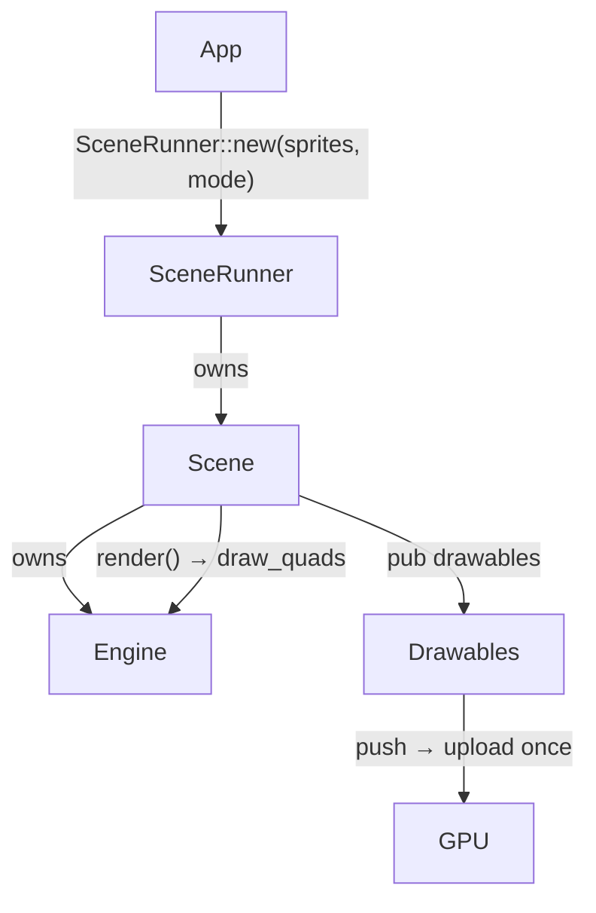

# HaBoard

A cross-platform GPU-accelerated 2D sprite engine in Rust, built on [wgpu](https://wgpu.rs) and [winit](https://github.com/rust-windowing/winit).

The library lives in `haboard/`; runnable examples for desktop, web, and Android live in `examples/`.

---

## Key features

- **Multitouch** — each finger independently drags a drawable; touching a selected sprite moves the whole selection group.
- **Rubber-band selection** — drag over empty space in Edit mode to select every drawable the rectangle touches; transparent pixels don't count.
- **Edge-snap dragging** — hold Ctrl while dragging to snap the dragged object's edges into alignment with nearby objects.
- **Two modes**
  - `Edit` — click/drag to select and move, rubber-band selection, keyboard shortcuts (arrows, Delete, `+`/`-`, Escape), drag-and-drop image import.
  - `Run` — no selection UI; only unlocked drawables may be dragged.

---

## Quick start

The simplest path is `SceneRunner`, which handles window creation, the event loop, and drag-and-drop. See [`examples/demo-app/src/main.rs`](examples/demo-app/src/main.rs) for a complete, runnable example — it loads a persisted scene (or falls back to a default one), wires up save-on-change persistence and drag-and-drop image import, and runs.

For the low-level path — no `SceneRunner`, no `Sprite`, no persistence, a hand-rolled `ApplicationHandler` driving `Engine`/`Scene` directly — see [`examples/demo-app-lite/src/main.rs`](examples/demo-app-lite/src/main.rs).

---

## Custom `Drawable`

`Drawable` requires only plain-data methods — no GPU state — and its default hit-testing can be overridden for non-rectangular shapes. See [`examples/demo-app-lite/src/object.rs`](examples/demo-app-lite/src/object.rs) for a complete example: a procedurally-textured circle with a true circular hit-test in place of the default bounding-box check.

Mix different types in the same scene with `Box<dyn Drawable>`.

---

## Architecture



`Drawable::image()` is called once, on `push` — implementors never hold a GPU handle. Selection state and Z-sorting are managed by `Drawables`/`Scene`, not the user type.

---

## Running the demos

**Desktop**

```sh
cargo run -p demo-app          # Edit mode (default)
cargo run -p demo-app -- --mode run
```

The demo loads `scene.bin` from the working directory (or starts with default sprites) and saves it back on close. In Edit mode, image files can be dragged and dropped onto the window to add them as sprites.

```sh
cargo run -p demo-app-lite
```

`demo-app-lite` shows the low-level path: no `SceneRunner`, no `Sprite`, no persistence — just a hand-rolled `winit::ApplicationHandler` driving `Engine`/`Scene` directly, populated with a custom `Drawable` (a procedurally-textured, circularly hit-tested object).

**Web (wasm)** — via [Trunk](https://trunkrs.dev):

```sh
rustup target add wasm32-unknown-unknown
cargo install trunk
cd examples/web-demo && trunk serve --release      # http://127.0.0.1:8080
```

WebGPU is used where available (Chrome/Edge), with a WebGL fallback (Firefox/Safari).

**Android** — via [cargo-apk](https://crates.io/crates/cargo-apk) (needs the Android SDK + NDK):

```sh
rustup target add aarch64-linux-android   # or x86_64-linux-android for an emulator
cargo install cargo-apk
cd examples/android-demo && cargo apk run
```

`web-demo` and `android-demo` are excluded from the default workspace build (they only link for their own targets) — build each from its own directory. Drag-and-drop image import and `scene.bin` persistence are desktop-only.

---

## Prerequisites

- Rust stable ≥ 1.85 (edition 2024)
- A GPU with Vulkan, Metal, DX12, or WebGPU support
