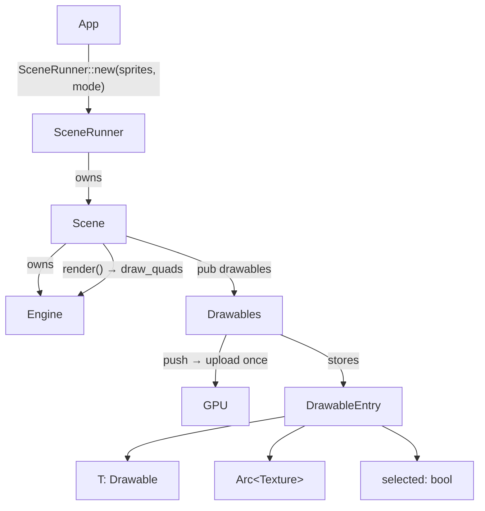

# HaBoard

A GPU-accelerated 2D sprite engine in Rust, built on [wgpu](https://wgpu.rs) and [winit](https://github.com/rust-windowing/winit).

```
gpu-test/
├── haboard/        # Library crate — engine, scene, drawables, textures
├── demo-app/       # Desktop binary — demo application
├── web-demo/       # Web (wasm) example — runs in the browser
└── android-demo/   # Android example — runs on device/emulator
```

The same engine and the shared demo scene (`haboard::demo`, behind the `demo-scene`
feature) run on desktop, web, and Android from one code path.

---

## Running the demo

```sh
cargo run -p demo-app          # Edit mode (default)
cargo run -p demo-app -- --mode run
```

The demo loads `scene.bin` from the working directory (or starts with default sprites) and saves it back on close. In Edit mode, image files can be dragged and dropped onto the window to add them as sprites.

---

## Key features

- **Pixel-space rendering** — wgpu quad pipeline; vertex shader converts pixel coordinates to NDC via a screen-size uniform. Alpha blending with per-vertex tint.
- **`Drawable` trait** — only geometry, Z-order, a lock flag, and `image() -> ImageData`. Implementors are plain data structs with no GPU handles; they can derive `serde` without a translation layer.
- **`ImageData`** — engine-independent image type (`Rgba` raw bytes or `Encoded` file bytes). Arc-backed, cheap to clone, fully serializable.
- **`Drawables<T>`** — managed collection that calls `Drawable::image()` exactly once on `push`, uploads the result to the GPU, and stores the `Arc<Texture>` internally. Also tracks `selected` state per entry.
- **Explicit Z-order** — render order and hit-testing sort by `z: f32` at call time; reordering is a field write, not a `Vec` shuffle. Clicking an object bumps it to the front.
- **Alpha-aware hit testing** — screen coordinates are mapped to texel coordinates; transparent pixels are ignored for both click selection and rubber-band selection.
- **Selection tinting** — tint is blended into `rgb` using `tint.a` as the mix factor; the texture `alpha` is preserved, so transparent pixels stay transparent.
- **Two modes**
  - `Edit` — click/drag to select and move, rubber-band selection, keyboard shortcuts (arrows, Delete, `+`/`-`, Escape), drag-and-drop image import.
  - `Run` — no selection UI; only unlocked drawables may be dragged.
- **Multitouch** — each finger independently drags a drawable; touching a selected sprite moves the whole selection group. A single touch can start rubber-band selection.
- **Ctrl interaction** — Ctrl+click or Ctrl+tap toggles selection without clearing the rest of the group and bumps Z on add. Ctrl+click on empty space is a no-op.
- **`SceneRunner`** — ready-made `winit` `ApplicationHandler` that owns a `Scene<Sprite>` and handles the full lifecycle. Provides an `on_event` hook for custom shortcuts.
- **Procedural textures** — `textures::checkerboard`, `solid`, `gradient`, `circle` — all return `ImageData` directly.

---

## Quick start

The simplest path is `SceneRunner`, which handles window creation, the event loop, and drag-and-drop:

```rust
use haboard::{DroppedImage, FileStore, SceneMode, SceneRunner, SceneStore, Sprite, textures};

fn main() {
    let sprites = vec![
        Sprite::new(20.0, 20.0, 256.0, 256.0, textures::gradient(128, 128)),
        Sprite::new(300.0, 50.0, 128.0, 128.0, textures::circle(128, [255, 160, 20])),
    ];

    let store = FileStore::app_data();
    let sprites = store
        .as_ref()
        .and_then(|s: &FileStore| SceneStore::<Sprite>::load(s))
        .unwrap_or(sprites);

    let mut runner = SceneRunner::new(sprites, SceneMode::Edit);

    // Optional: hook into window events (e.g. Ctrl+S shortcuts).
    runner.on_event(|event, modifiers, scene| {
        // handle custom events here
    });

    // Persist after each committing interaction (drag release, keypress, drop).
    if let Some(store) = store {
        runner = runner.on_change(move |scene| {
            let items: Vec<Sprite> = scene.drawables.iter().cloned().collect();
            store.save(&items);
        });
    }

    // Turn a dropped image file into a Sprite.
    runner = runner.on_drop_image(|d: DroppedImage| {
        Sprite::new(d.x, d.y, d.width, d.height, d.image)
    });

    // On desktop, `run` blocks until the window closes.
    // (On web use `spawn`; on Android use `run_with`.)
    runner.run();
}
```

---

## Custom `Drawable`

`Drawable` requires only plain-data methods — no GPU state:

```rust
use haboard::{Drawable, ImageData};

#[derive(serde::Serialize, serde::Deserialize)]
struct Card { x: f32, y: f32, z: f32, image: ImageData, pinned: bool }

impl Drawable for Card {
    fn x(&self) -> f32 { self.x }
    fn y(&self) -> f32 { self.y }
    fn width(&self) -> f32 { 120.0 }
    fn height(&self) -> f32 { 160.0 }
    fn z(&self) -> f32 { self.z }
    fn set_z(&mut self, z: f32) { self.z = z; }
    fn set_position(&mut self, x: f32, y: f32) { self.x = x; self.y = y; }
    fn locked(&self) -> bool { self.pinned }

    /// Called exactly once when pushed via `Drawables::push`.
    fn image(&self) -> ImageData { self.image.clone() }
}
```

Mix different types in the same scene with `Box<dyn Drawable>`:

```rust
let scene = Scene::new(engine, vec![Box::new(card), Box::new(sprite)], SceneMode::Edit);
```

---

## Architecture



**Key design decisions**

- `Drawable::image()` is called **once** on `push`; the implementor never holds a GPU handle.
- **Selection lives in `DrawableEntry`**, not in the user type.
- **Z is a field**, not a `Vec` index — sorting happens at render/hit-test time.

---

## Module overview

| Module | Description |
|---|---|
| `engine` | wgpu device, queue, render pipeline, `draw_quads` |
| `scene` | `Scene<T>` — drives interaction and rendering via `handle_window_event` / `render` |
| `scene_runner` | `SceneRunner<T>` — ready-made `ApplicationHandler` wrapping a `Scene<T>`; `on_change` for persistence, `on_drop_image` for file drops |
| `drawables` | `Drawables<T>` — GPU-texture-owning collection with selection state |
| `drawable` | `Drawable` trait |
| `image_data` | `ImageData` — `Rgba` or `Encoded`; Arc-backed, serializable |
| `sprite` | `Sprite` — built-in serializable `Drawable` |
| `texture` | GPU texture with CPU-side RGBA copy for alpha hit-testing |
| `textures` | Procedural generators: `checkerboard`, `solid`, `gradient`, `circle` |

---

## Platforms

`haboard` targets desktop, web, and Android from a single codebase. The two
example crates are **excluded from the default workspace build** (they only link
for their own targets) — build each from its own directory.

**Desktop**

```sh
cargo run -p demo-app
```

**Web (wasm)** — via [Trunk](https://trunkrs.dev):

```sh
rustup target add wasm32-unknown-unknown
cargo install trunk
cd web-demo && trunk serve --release      # http://127.0.0.1:8080
```

WebGPU is used where available (Chrome/Edge), with a WebGL fallback (Firefox/Safari).

**Android** — via [cargo-apk](https://crates.io/crates/cargo-apk) (needs the Android SDK + NDK):

```sh
rustup target add aarch64-linux-android   # or x86_64-linux-android for an emulator
cargo install cargo-apk
cd android-demo && cargo apk run
```

Platform notes: the web path initialises the GPU asynchronously (no blocking) and
attaches a full-page canvas; Android releases and recreates the GPU surface across
suspend/resume. Drag-and-drop image import and `scene.bin` persistence are
desktop-only.

---

## Prerequisites

- Rust stable ≥ 1.85 (edition 2024)
- A GPU with Vulkan, Metal, DX12, or WebGPU support
