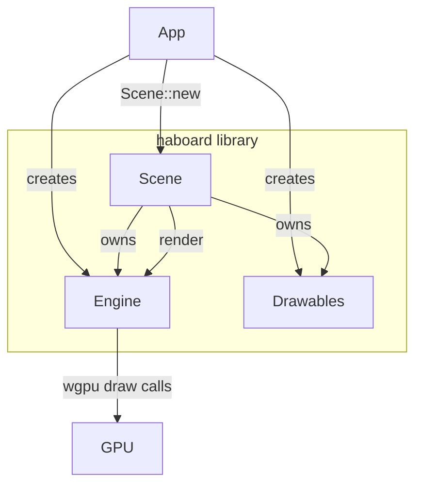

# HaBoard

A GPU-accelerated 2D sprite engine written in Rust, built on [wgpu](https://wgpu.rs) and [winit](https://github.com/rust-windowing/winit).

HaBoard provides a reusable library crate (`haboard`) for rendering and interacting with 2D sprites, plus a `demo-app` binary that shows the engine in action.

---

## Workspace layout

```
gpu-test/
├── haboard/        # Library crate — engine, scene, sprites, textures
└── demo-app/       # Binary crate — demo application
```

---

## Features

- **wgpu rendering** — pixel-space quad rendering with alpha blending; vertex shader converts pixel coordinates to NDC using a screen-size uniform.
- **`Drawable` trait** — implement one trait to make any object renderable and interactable.
- **`Scene<T>`** — generic scene manager that owns drawables and drives all interaction; use `Scene<Sprite>` for zero-allocation homogeneous collections or `Scene<Box<dyn Drawable>>` for heterogeneous ones.
- **Two interaction modes**
  - `Edit` — click to select, drag a selected group, rubber-band selection with visual overlay (selection halo + tint).
  - `Run` — no selection UI; only unlocked drawables may be dragged (single topmost object at a time).
- **Alpha-aware hit testing** — `Sprite` maps screen coordinates to texel coordinates and rejects transparent pixels, so clicks and rubber-band selection ignore see-through areas.
- **Procedural textures** — the `textures` module generates checkerboards, solid colours, gradients, and anti-aliased circles entirely on the CPU and uploads them to the GPU.
- **Touch support** — primary-touch events are mapped to the same interaction handlers as mouse events.

---

## Prerequisites

- Rust toolchain (edition 2024, stable ≥ 1.85)
- A GPU with a Vulkan, Metal, DX12, or WebGPU-compatible driver

---

## Build & run

```sh
# build everything
cargo build

# run the demo in the default Edit mode
cargo run -p demo-app

# run in Run mode
cargo run -p demo-app -- --mode run
```

### CLI options

```
Usage: demo-app [OPTIONS]

Options:
      --mode <MODE>  Start the engine in edit or run mode [default: edit]
                     Possible values: edit, run
  -h, --help         Print help
  -V, --version      Print version
```

---

## Library API

Add the library to your `Cargo.toml`:

```toml
[dependencies]
haboard = { path = "../haboard" }
```

### Quick-start example

```rust
use std::sync::Arc;
use haboard::{Engine, Scene, SceneMode, Sprite, textures};

// 1. Create the engine (owns the wgpu device/queue and the window).
let engine = Engine::new(window).await;

// 2. Build textures.
let bg  = textures::gradient(&engine, 256, 256);
let btn = textures::circle(&engine, 64, [255, 100, 50]);

// 3. Create drawables.
let drawables = vec![
    Sprite::new(0.0, 0.0, 256.0, 256.0, bg),
    Sprite::new(96.0, 96.0, 64.0, 64.0, btn),
];

// 4. Hand everything to the scene.
let mut scene = Scene::new(engine, drawables, SceneMode::Edit);

// 5. In your event loop:
scene.handle_window_event(&event);  // forward winit events
scene.render();                     // draw the frame
```

### Implementing a custom drawable

```rust
use std::sync::Arc;
use haboard::{Drawable, Texture};

struct Card {
    x: f32, y: f32,
    texture: Arc<Texture>,
    pinned: bool,
}

impl Drawable for Card {
    fn x(&self) -> f32 { self.x }
    fn y(&self) -> f32 { self.y }
    fn width(&self) -> f32 { 120.0 }
    fn height(&self) -> f32 { 160.0 }
    fn texture(&self) -> &Arc<Texture> { &self.texture }
    fn set_position(&mut self, x: f32, y: f32) { self.x = x; self.y = y; }
    fn locked(&self) -> bool { self.pinned }
}
```

Use `Scene<Box<dyn Drawable>>` to mix different types in the same scene:

```rust
let drawables: Vec<Box<dyn Drawable>> = vec![
    Box::new(card),
    Box::new(sprite),
];
let scene = Scene::new(engine, drawables, SceneMode::Edit);
```

---

## Module overview

| Module | Description |
|---|---|
| `engine` | wgpu device, queue, render pipeline, and the `render_drawables` method |
| `scene` | `Scene<T>` — owns drawables, selection state, and interaction logic; exposes `handle_window_event` and `render` |
| `drawable` | `Drawable` trait and a blanket `impl` for `Box<D: Drawable>` |
| `sprite` | `Sprite` — built-in `Drawable` with alpha-aware hit testing |
| `texture` | GPU texture wrapper with a CPU-side RGBA copy for hit testing |
| `textures` | Procedural texture generators: `checkerboard`, `solid`, `gradient`, `circle` |

---

## Architecture


